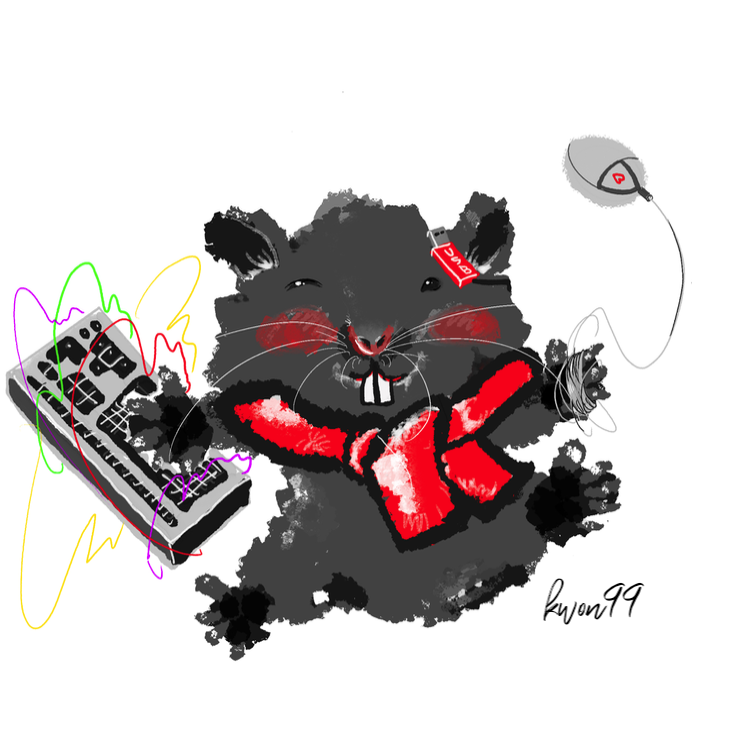

<!-- PROJECT SHIELDS -->
[![Contributors][contributors-shield]][contributors-url]
[![Forks][forks-shield]][forks-url]
[![Stargazers][stars-shield]][stars-url]
[![Issues][issues-shield]][issues-url]

<!-- PROJECT LOGO -->
 

  
  <h3 align="center">WIL</h3>
  

    What I Learned 📚
  

<!-- TABLE OF CONTENTS -->

  
TABLE

  <ol>
    <li>
      <a href="#들어가며">들어가며</a>
    </li>
    <li>
      <a href="#WHAT">WHAT</a>
      <ul>
        <li><a href="#C">C</a></li>
      </ul>
    </li>
    <li>
      <a href="#WHY">WHY</a>
      <ul>
        <li><a href="#Pwnable">Pwnable</a></li>
        <li><a href="#Reversing">Reversing</a></li>
      </ul>
    </li>
  </ol>

<!-- ABOUT THE PROJECT -->
## 들어가며
배운 내용을 정리하고, 미래의 누군가 혹은 나에게 도움이 되길 바라며 작성합니다. 

*__reference__*
* [g0pher-WIL](https://github.com/g0pher98/WIL)
* [how2heap](https://github.com/shellphish/how2heap)

(<a href="#top">back to top</a>)

<!-- WHAT -->
## WHAT

### C

<!-- WHY -->
## WHY

### Pwnable
* [send와 sendline의 차이점](https://github.com/kwon99/WIL/blob/main/Security/Pwnable/sendline.md)
* [libc 파일이 제공되지 않았을 때](https://github.com/kwon99/WIL/blob/main/Security/Pwnable/libc-database.md)

### Reversing

(<a href="#top">back to top</a>)

## Contact

* [Instagram](https://www.instagram.com/kyh_0312)

(<a href="#top">back to top</a>)

<!-- MARKDOWN LINKS & IMAGES -->
<!-- https://www.markdownguide.org/basic-syntax/#reference-style-links -->
[contributors-shield]: https://img.shields.io/github/contributors/kwon99/WIL.svg?style=for-the-badge
[contributors-url]: https://github.com/kwon99/WIL/graphs/contributors
[forks-shield]: https://img.shields.io/github/forks/kwon99/WIL.svg?style=for-the-badge
[forks-url]: https://github.com/kwon99/WIL/network/members
[stars-shield]: https://img.shields.io/github/stars/kwon99/WIL.svg?style=for-the-badge
[stars-url]: https://github.com/kwon99/WIL/stargazers
[issues-shield]: https://img.shields.io/github/issues/kwon99/WIL.svg?style=for-the-badge
[issues-url]: https://github.com/kwon99/WIL/issues
[product-screenshot]: images/screenshot.png
